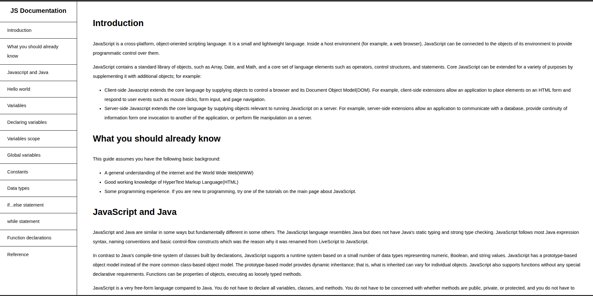

# Technical Documentation

## Overview
This project focuses on an HTML technical documentation page for the **JavaScript** programming language. This is a very beneficial documentation for someone just starting up with JavaScript. It's documents aspects in Javascript like variable, functions, constants, if-statements and many more.

## Preview
``` HTML
    <div id="content">
                <nav id="nav-document"> 
                    <header>JS Documentation </header>
                    <ul id="sidebar">
                        <li><a class="nav-list" href="#introduction">Introduction</a></li>
                        <li><a class="nav-list" href="#already-know">What you should already know</a></li>
                        <li><a class="nav-list" href="#javascript">Javascript and Java</a></li>
                        <li><a class="nav-list" href="#world">Hello world</a></li>
                        <li><a class="nav-list" href="#variable">Variables</a></li>
                        <li><a class="nav-list" href="#declare-var">Declaring variables</a></li>
                        <li><a class="nav-list" href="#var-scope">Variables scope</a></li>
                        <li><a class="nav-list" href="#global-var">Global variables</a></li>
                        <li><a class="nav-list" href="#const">Constants</a></li>
                        <li><a class="nav-list" href="#data">Data types</a></li>
                        <li><a class="nav-list" href="#if">if...else statement</a></li>
                        <li><a class="nav-list" href="#while">while statement</a></li>
                        <li><a class="nav-list" href="#function">Function declarations</a></li>
                        <li><a class="nav-list" href="#reference">Reference</a></li>  
                    </ul>
                </nav>
   
```


## Project technical
This documentation page is built with;
> HTML
> CSS
> Vs Code

## Project architecture
This project has the folder following structure;
- A `.github` folder that contains a linters file for checking errors in the code
- An *asset* folder containing images
- `README` file
- Index file where all the HTML code is written
- CSS file for styling the index HTML file

## Installation
To run the HTML file, you can do the following;
- Get a local copy of this project either by cloning this [repository](git@github.com:AsohLove/Technical-documentation.git) on the terminal/command line or *Download ZIP* manually from the GitHub repository on the web. 
- Navigate to the repository directory(using cd) or unzipped the manually downloaded repository
- Locate the HTML file(index.html)
- Double-click the HTML file to open it on your default browser or install and run it with a built-in server in your **IDE such as the Live Server extension in VS Code.**

## Deployment
The project can also be accessed on this [Deployed page](https://asohlove.github.io/Technical-documentation/).

### Author
*Love Asoh*

- GitHub: [@loveasoh](https://github.com/AsohLove)
- Twitter: [@loveasoh](https://x.com/LoveTheModifier)
- LinkedIn: [@love asoh](https://www.linkedin.com/in/asohlove/)


## License
This project is [MIT](./LICENSE) licensed.